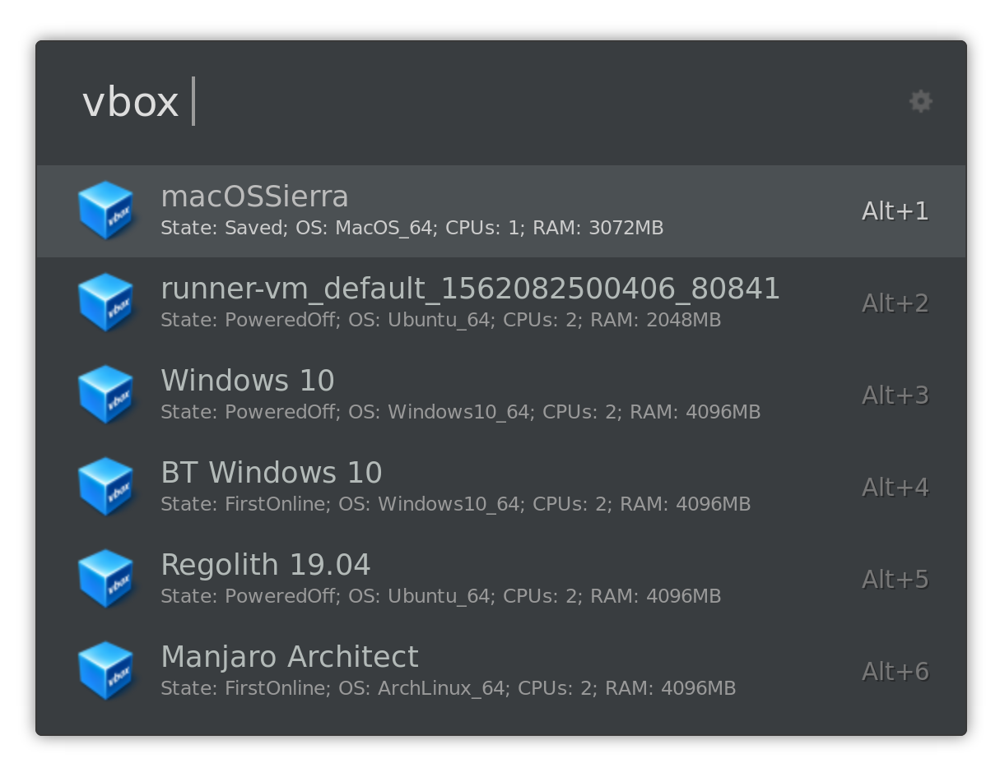
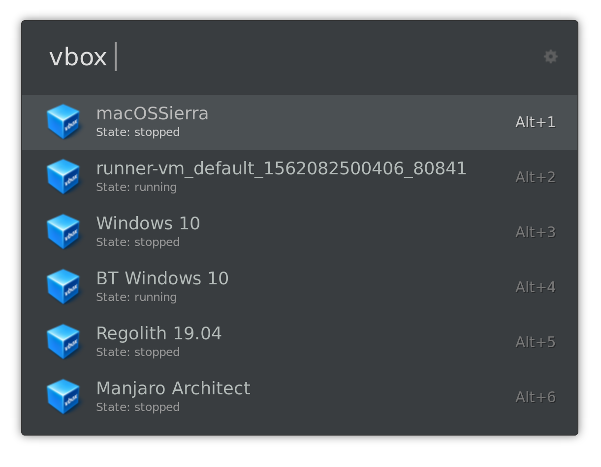

# Ulauncher VirtualBox

Simple ulauncher extension to start your virtualbox vms.

## Requirements
  * ulauncher 5.0
  * VirtualBox

There are optional dependencies, to get extra status info on each machine:

  * python3-virtualbox (optional) (`pip3 install virtualbox`)
  * python3-vboxapi - this is not installable via pip and might or not come with your virtualbox
  package. It does in Ubuntu.

## Screenshots

### With the virtualbox python modules

### Without the virtualbox python modules

 